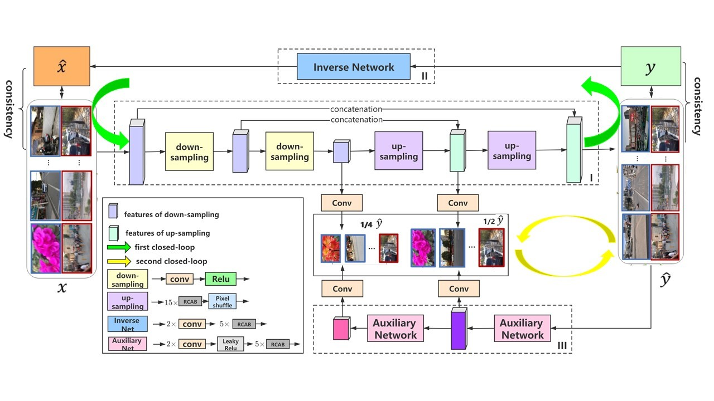
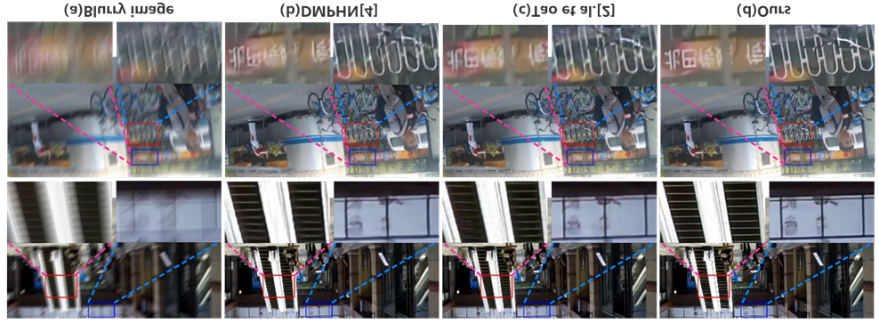
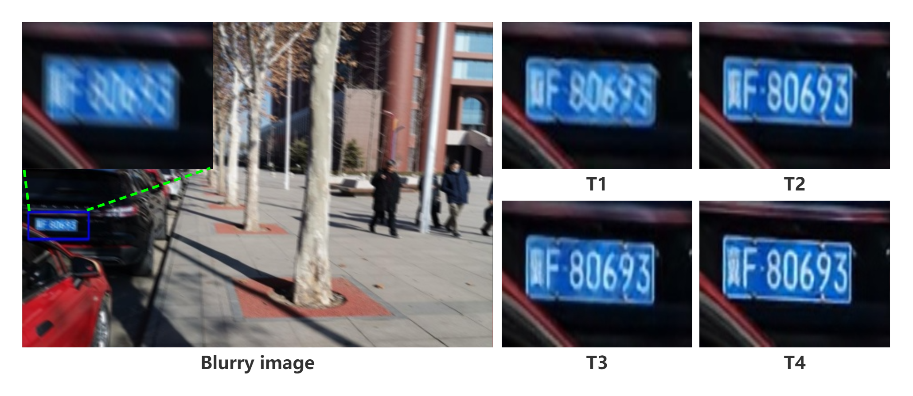

# Implementation for ：**DOUBLE CLOSED-LOOP NETWORK FOR IMAGE DEBLURRING**

### The source codes for our published papers. We will release them later.

# Abstract
In this paper, a deep learning network with double closed-loop structure is introduced to tackle the image deblurring problem. The first closed-loop in our model is composed of two networks which learn a pair of opposite mappings between the blurry and sharp images. By this way, the solution spaces of possible functions that map a blurry image to its sharp counterpart can be effectively reduced. Furthermore, the first closed-loop also helps our model to deal with the unpaired samples in the training set. The second closed-loop in the proposed approach employed a self- supervision mechanism to constrain the features of intermedia layers in the network, so that the detailed information of sharp images can be well exploited. Through combining the two closed-loops together, our model can address the limitations of existing methods and improve the deblurring performance. Extensive experiments on both benchmark and real-world datasets show that the proposed network achieves state-of-the-art performance.

Fig.1 The structure of the proposed network(DCLNet).

Fig 2. Visual comparison of the deblurring results on GoPro dataset.

Fig 3. Visual comparison of the deblurring results on HIDE dataset.

Fig 4. Visual comparison of the deblurring results obtained by some methonds on DCLData dataset under scheme T1

Fig 5.Visual comparsion of different trining data selection schemes on DCLData dataset.
